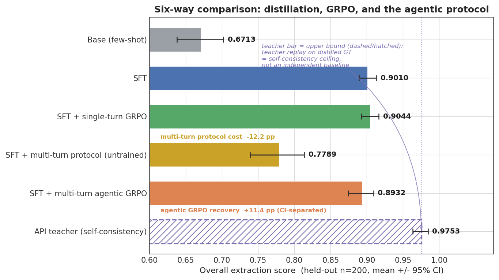
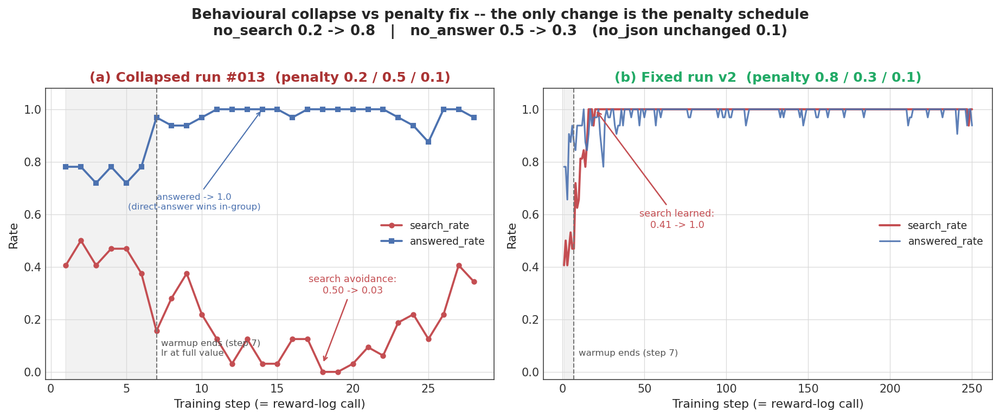
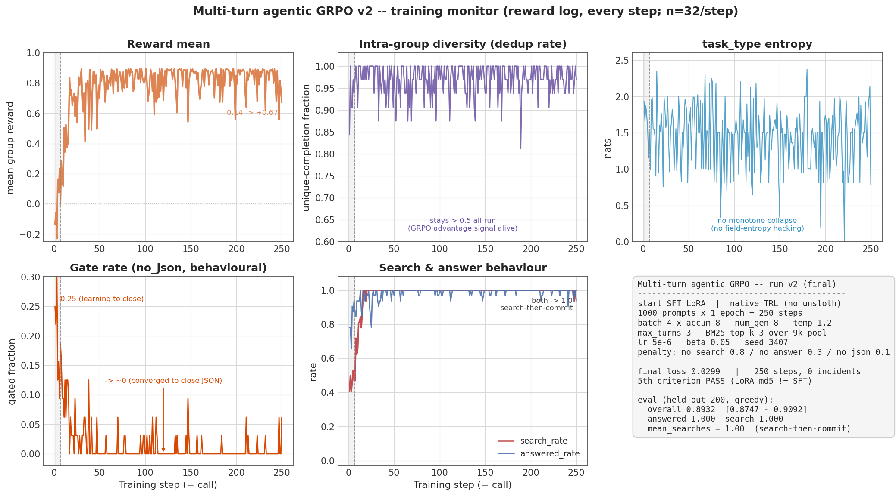
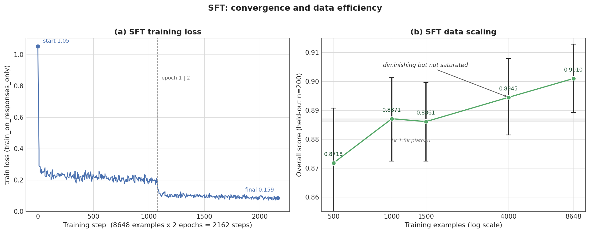

# AcademicExtract-R1

**学术论文元数据多轮检索-抽取 Agent 的 GRPO 后训练**：单卡 RTX 4090 上完成 SFT → 单轮 GRPO → 多轮 Agentic GRPO 三阶段 pipeline，Qwen3-4B + LoRA 替换自建 Academic RA 系统中的 API 抽取组件。字段级 F1 **0.671 → 0.904**（+34.7%），多轮 agent 形态下 RL 净增益 **+11.4pp**（95% CI 完全分离），全程成本 **< ¥50**（GPU ¥35 ≈ 17 卡时 + 蒸馏 API ¥5.85）。

## 结果先看

| 对照方 | overall F1 (holdout 200) | 95% CI |
|---|---|---|
| Qwen3-4B base few-shot | 0.6713 | — |
| + SFT（8,648 条蒸馏数据） | 0.9010 | [0.889, 0.913] |
| + 单轮 GRPO | 0.9044 | [0.892, 0.917] |
| SFT + 多轮协议（未训练） | 0.7789 | [0.739, 0.813] |
| **+ 多轮 Agentic GRPO** | **0.8932** | [0.875, 0.909] |
| API 教师上界（自一致性）* | 0.9753 | [0.964, 0.984] |

\* 教师（DeepSeek-V3）同配置对自己蒸馏出的 GT 重放，是**自一致性上界**（"教师即天花板"的显式化），不是独立能力数字；它与 1.0 的 2.5pp 缺口就是本任务的噪声地板。



**三格分解——agent 化成本的量化**（同一 SFT 权重的三种形态）：

> 单轮 0.901 → 塞进多轮协议未训练 0.779 → 多轮 GRPO 训练后 0.893
> **多轮协议成本 −12.2pp**（未训模型动作错误 1.03 次/条、9% 不作答）
> **RL 净增益 +11.4pp**（CI 完全分离，全项目 RL 阶段唯一显著增量）
> **agent 形态相对单轮上限仅 −0.8pp**（不显著）
>
> 每一个百分点都有归处：RL 的作用被定位为**行为塑形**（把 agent 化的协议成本几乎全部吃回），而非信息获取。

## 全项目最有信息量的一张图



同模型、同数据、同框架，**只改两个 reward 数字**（action penalty 0.2/0.5 → 0.8/0.3）：左边模型在 warmup 结束后 6 步内学会"永不检索"（search avoidance，[Search-R1++](https://arxiv.org/abs/2602.19526) 报告的 answer avoidance 的镜像），右边行为精确收敛到定价点——检索率 100%、作答率 100%、平均检索**恰好 1.00 次/条**。reward 工程就是行为工程，完整复盘见 [docs/incidents.md#013](docs/incidents.md)。

## 任务与动机

自建 Academic RA 系统的抽取组件依赖商用 API，三个痛点：成本、延迟（P50 6.94s）、数据出域。将"论文六字段元数据抽取"（含 benchmarks 三元组难字段：`(benchmark, metric, value)`）定义为可验证任务，用 4B 小模型 + LoRA 自训替换——**高频、固定 schema、数据敏感的场景自训小模型，知识与判断密集的环节调 API**，这是本项目用数字换来的选型结论（学生-教师 gap 主要在 GT 质量而非模型容量）。

## 方法

### 1. 可溯源数据管线（合成即验证）

```
arXiv 官方接口 24.9 万篇 → 时间窗过滤（id 前缀 ≥2507，防 cutoff 污染）→ 分层抽样 9,000 篇
→ DeepSeek-V3 蒸馏（temp0，INVALID 升温重试）
→ schema validator 复用为 rejection filter（拒收 121 条全留痕）
→ grounding 五类自动核对（教师幻觉标记率 12.5%：占位三元组 / 模态过度外推为两大系统性错误）
→ 13-gram 去污染（train/holdout 重叠率 0.01%，2% 阈值门控）
→ train 8,648 / holdout 200 / 人工复核壳 50（可疑样本优先入壳）
```

蒸馏全程 ¥5.85（9,482 请求 / 19.01M tokens）。数据 scaling 五点 0.872→0.901 边际递减但未饱和（fig4）。

### 2. 分层可验证 reward（validator 三位一体）

同一个 schema validator 在三处复用：**数据合成的 rejection filter ＝ 训练的 reward 硬门控 ＝ 评测器**——合成即验证、训练即评测，verifier-as-reward 贯穿全链路。

reward 结构：合法 JSON / 重复键 / 键齐全三重硬门控 → 字段级 F1 按类型分派（枚举 exact / 列表 bipartite 匹配 / 布尔）→ benchmarks 三元组 F1 权重 3× → action-level penalty（多轮）。针对 Search-R1++ 实测"检索任务 GRPO 最不稳、纯 F1 训崩"的稳定化设计——**该风险在本项目真实发生（#013）并被系统性修复**。

### 3. 多轮 Agentic 升级与 retrieved-token loss mask

单轮抽取升级为多轮检索-抽取 loop：信息充分性判断 → BM25 检索 9,000 篇本地库（exclude_id 屏蔽论文自身防泄漏捷径）→ 再抽取 → schema 自检收针。Search-R1 状态机三函数单卡 TRL 化移植：动作协议解析 / 截断防幻觉续写（保护 `</information>` 闭合标签）/ 非法动作纠错不终止 / active_mask 批内轨迹管理 / 最后一轮强制收针。

**TRL 接线的关键坑**：TRL 0.22 的 `completion_mask` 双职耦合（loss 加权 + attention 拼接）——直接把检索段置 0 会同时屏蔽 attention，导致 logprob 口径漂移、importance ratio 有偏。正确做法是**双 mask 分离**：`completion_mask` 保留 attention 语义，新增 `info_mask` 单独管 loss（retrieved token 不入梯度、attention 可见），mask 位置逐 token 单测 + 可视化断言。施工图：[docs/stage-c-trl-wiring.md](docs/stage-c-trl-wiring.md)。

### 4. 三段论瓶颈定位

- 单轮 GRPO +0.34pp（CI 重叠）但实质改写 72% 输出、净胜仅 7 → **排除对齐瓶颈**（撞到 reward 语义区分度天花板，GT 噪声字段 method_keywords 是赢输主战场）；
- 多轮检索 benchmarks 字段 0.825 vs 单轮 0.823 持平 → **排除信息瓶颈**（检索信息增量 ≈ 0）；
- 教师 temp0 重放自己只有 0.9753 → **天花板锁定在蒸馏 GT 噪声**。

## 训练全程监控




每条监控线都抓获过真实事故：组内去重率（#009 advantage 衰减）、adapter md5（#010 权重空转）、std/熵/行为率（#013 行为塌缩）、gate 明细（#012 schema 缺字段）。

## 事故簿（六条完整留痕）

真实训练不是曲线一路向上。六条 GPU 期事故的现象 → 怀疑链 → 实锤 → 根因 → 修复全程记录在 **[docs/incidents.md](docs/incidents.md)**：

| # | 一句话 |
|---|---|
| #008 | TRL 0.22 隐式要求 reward callable 带 `__name__`，90 秒冒烟关卡抓崩 |
| #009 | 高置信 prompt 采样收敛 → 组内 advantage 归零，升温 1.2 对症 |
| #010 | **GRPO 500 步权重全程空转**：md5 实锤链 + KL 全程假信号（PEFT ref=base） |
| #011 | unsloth GRPO patch 慢路态切换失守 → 原生 TRL+PEFT 重实现反而更快 |
| #012 | MT prompt 从截断输出抄 schema 漏 1 字段 → gate 率 100% |
| #013 | **penalty 天平失衡 6 步训出"永不检索"** → 两个数字消融 → 行为 100% 收敛 |

Phase 0 数据线事故（#001–#007，含 arXiv OAI 时间字段不可靠、教师系统性幻觉两类等）见 [runs/issues-log.md](runs/issues-log.md)。

## 复现

```bash
pip install -r requirements-dev.txt     # 本地开发与测试
pytest                                   # 164 项单测（含 mask 逐段断言、状态机三臂、纠错恢复）

# 数据管线（无 GPU，需 DEEPSEEK_API_KEY 环境变量）
python -m src.data.harvest_arxiv        # arXiv 采集
python -m src.data.filter_papers        # 时间窗 + 分层抽样
python -m src.data.distill              # 教师蒸馏（rejection filter + grounding 在线核对）
python -m src.data.decontaminate        # 13-gram 去污染
python -m src.data.to_sft_format        # SFT 格式 + train/holdout/人工壳切分

# 训练（RTX 4090 24GB，requirements-train.txt）
python -m src.training.sft_train        # SFT：8648×2ep，43min
python -m src.training.grpo_train --no-unsloth      # 单轮 GRPO：500 步 ~2.6h
python -m src.training.grpo_train_mt --no-unsloth   # 多轮 agentic GRPO：250 步 ~6.5h

# 评测（六方对照）
python -m src.eval.gen_predictions      # API / few-shot 侧
python -m src.eval.gen_predictions_mt   # 多轮贪心（3.5s/条）
python -m src.eval.evaluate             # bootstrap 95% CI
python docs/figures/make_figures.py     # 四张曲线图一键复现
```

每次 run 的完整配置与结果在 [runs/run-log.md](runs/run-log.md)（每 run 一条，run 结束 5 分钟内记录）；trajectory JSONL 全程落盘，seed 固定（3407），重放实测前 4 步逐位同值。

## 目录结构

```
src/
  data/        采集→过滤→蒸馏→grounding→去污染→切分（7 件套管线）
  reward/      reward_v1（三重门控+分层 F1+action penalty）、三元组匹配、相似度
  training/    sft_train / grpo_train / grpo_train_mt / multiturn_loop（SR 状态机移植）/ grpo_multiturn（双 mask TRL 子类）
  retrieval/   BM25 索引 + 检索服务（训练态进程内 / 部署态 FastAPI 双形态）
  eval/        评测器（bootstrap CI）+ 三种预测生成（API/本地/多轮）
  schema_model.py   唯一 schema 真相源（validator 三位一体的本体）
docs/
  incidents.md          训练期事故复盘包（#008–#013）
  stage-c-trl-wiring.md 双 mask TRL 接线施工图
  eval-protocol.md      评测协议（冻结）
  figures/              四张图 + 生成脚本
runs/
  run-log.md            每 run 一条的实验台账
  issues-log.md         全部 13 条事故一手记录
tests/                  164 项单测
```

## 局限与诚实声明

- 天花板在数据：蒸馏 GT 含教师噪声（grounding 标记率 12.5%），教师自重放仅 0.975——学生逼近的是这个含噪上界，不是任务真值。**独立复核子集（50 条，可疑优先采样）已完成**：条目级无实质错误 **94%**（异构 LLM 三层盲审交叉：机器 flag → 2×独立盲审 → 原文终裁，复核模型与教师非同家族），教师硬错误仅两个模式（占位三元组、模态外推），全部被 grounding flag 召回；全量硬错误率外推约 2%（推断值）。完整审计见 [runs/manual-shell-50-audit.md](runs/manual-shell-50-audit.md)。
- 多轮检索在本任务上信息增量 ≈ 0（benchmarks 持平）：抽取所需信息大多已在输入摘要内，检索的价值在行为协议的可训性验证，不在知识补全——这正是三格分解要回答的问题。
- 单模型（Qwen3-4B）、单任务（学术元数据）、单卡预算内的结论；跨模型尺寸与跨任务的外推未验证。
